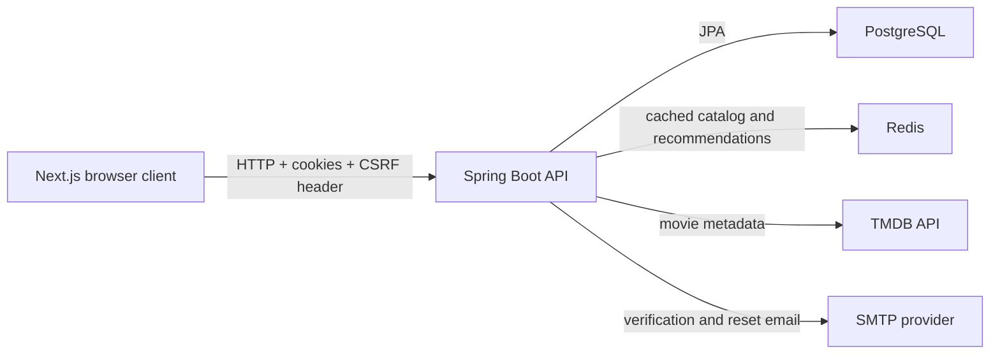
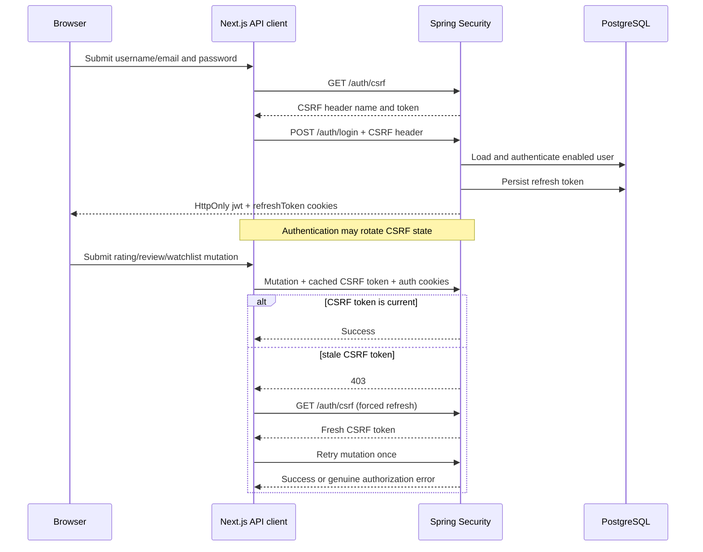

# AtlasWatch system and feature flows

This is a living guide to how the main parts of AtlasWatch interact. Update it whenever a change alters control flow, data flow, authentication, persistence, or deployment.

## System boundary

## Docker startup flow

Before startup, the backend image resolves Maven dependencies in a pom-only layer backed by a persistent BuildKit Maven cache, then compiles source in a separate layer using that same cache. Source-only changes therefore do not redownload unchanged dependencies.

1. Compose starts PostgreSQL and Redis.
2. Their health checks must pass before the backend starts.
3. Flyway validates migration history and applies pending migrations.
4. Hibernate validates that entity mappings match the resulting schema.
5. Spring Boot exposes `/actuator/health`; the backend container becomes healthy.
6. The frontend starts after backend health succeeds and serves Next.js on port 3000.

Failure boundary: an image can build successfully while its container later fails during Flyway, Hibernate, configuration, or health-check startup. `docker compose logs backend` distinguishes build success from runtime failure.

## Registration and email verification

1. `POST /auth/register` validates input and password strength.
2. `AuthService.signUp` creates or updates an unverified account.
3. A six-digit verification code and five-minute expiry are stored, and email delivery is requested.
4. `POST /auth/verify` checks account identity, code, and expiry.
5. Successful verification sets `enable = true` and clears verification fields.
6. Login rejects users whose `enable` flag is false.

## Password reset

1. `POST /auth/password-reset/request` always returns a neutral response to avoid revealing whether an email exists.
2. For an existing account, the backend stores a reset code with a ten-minute expiry and sends it by email.
3. `POST /auth/password-reset/confirm` validates password strength, code presence, equality, and expiry.
4. The backend stores the newly encoded password and clears reset fields.
5. Password reset does not alter the account's email-verification flag.

## Login, cookies, CSRF, and token refresh

For non-auth API requests that return `401`, the client calls `POST /auth/refresh`. A valid refresh token is rotated, new access and refresh cookies are returned, and the original request is retried.

## Rating and review flow

1. The movie page publicly loads movie details, reviews, and rating summary.
2. When a JWT cookie exists, it also requests the current user's review for that movie.
3. Selecting a star creates a review record containing a rating and optional empty review text, or updates the existing record.
4. `JwtAuthFilter` reads the HttpOnly JWT cookie and places the matching user in Spring's security context.
5. `ReviewController` receives that user through `@AuthenticationPrincipal`.
6. `ReviewService` validates the 1–10 rating, resolves/caches the movie, saves the record, and invalidates recommendation-related cache state.
7. The frontend reloads the user's review, public reviews, and rating summary so the UI reflects the saved score.

Authentication boundary: the presence of a browser cookie is only a UI hint. The backend remains authoritative and can reject an expired, invalid, or missing JWT.

## Pick for Me recommendation flow

1. The frontend sends selected moods, runtime preference, optional release eras, result limit, rotation key, optional starter signals, and at most 50 TMDB IDs already displayed in the current session. Any era means no release-year preference; explicit eras form a union of allowed year ranges.
2. The backend resolves authentication. Signed-in requests build a historical taste profile; anonymous requests build a cold-start profile.
3. For an authenticated user, up to ten recent movies rated at least 8/10 or retained on the active watchlist seed the pre-trained 64-factor model. Review strengths weight the seed vectors; their latent profile is projected against all mapped item vectors, normalized, and resolved into locally available TMDB movies. Missing seeds or a missing/corrupt artifact produce an empty optional channel rather than failing the request.
4. `CandidateRetriever` merges watchlist, genre-affinity, mood, collaborative, popular, confidence-adjusted high-rated, and content-similarity channels.
5. `RecommendationScorer` calculates taste, per-requested-mood coverage, runtime, confidence-adjusted quality, popularity, watchlist, source-count, collaborative, and penalty features. The collaborative feature has a bounded 0.06 weight and is absent for anonymous/no-history requests. Quality shrinks a TMDB average toward the configured catalog prior according to `vote_count`; the raw average remains unchanged for display. Specific moods may use a direct genre proxy, while ambiguous moods require phrase-boundary evidence from TMDB keywords or the overview.
6. When explicit eras are present, `RecommendationService` removes every movie outside their combined year ranges. This strict boundary runs before fallback gates so later tiers are chosen from the eligible period rather than filtered after the fact.
7. `RecommendationService` keeps the strongest mood-coverage tier that can fill the requested count without crossing its quality floor: one mood retains graceful fallback, two require at least one match, an exact three-mood request requires all three, and broader blends require at least 60% coverage. It returns fewer results rather than padding below that floor, then removes tolerance-only runtime matches when enough exact matches remain.
8. The remaining candidates are ordered with explicit mood coverage ahead of the generic weighted score.
9. Diversity and personalized calibration use the same intent-aware score, so reranking cannot undo the active request.
10. After the ordinary slate is built, session rotation prefers qualified candidates not present in the displayed-ID set. Authenticated requests also include distinct server impressions from the previous six hours. If unseen supply is insufficient, baseline items fill the remaining slots; if unseen substitutions would lower aggregate rule-derived mood coverage, only the strongest missing baseline items needed to restore that floor return.
11. Human-readable reasons are generated only from active scoring signals. Mood reasons name only the moods actually covered and cite concrete story cues when available; explicit era reasons name the movie year and matching period. Strong collaborative matches identify MovieLens viewing-pattern evidence. Freshness is not a default preference.
12. The response is cached under a key containing the recommendation algorithm version, normalized moods/runtime/eras, user/profile context, rotation key, and displayed-ID set.
13. Authenticated display recording deduplicates a response and omits movies already impressed for that user in the prior six hours.

Fallback boundary: single-mood and runtime fallbacks may retain candidates when strict filtering would return too few. Multi-mood coverage floors and explicit release eras never relax; a shorter list is preferable to silently violating visible intent.

## Pick for Me navigation-state flow

1. The first visit loads recommendations automatically from the authenticated or cold-start endpoint.
2. After a successful response, the page unions returned TMDB IDs into a 50-ID session set and writes that set with its filters, rotation token, authentication mode, and result DTOs to tab-scoped `sessionStorage`.
3. Opening a movie detail and navigating Back remounts the page, restores the stored state, and skips the automatic API call once. The exact shortlist remains visible.
4. Changing a filter starts a new displayed-ID history, triggers a new request, and replaces the stored snapshot after success.
5. `Try another mix` creates a new refresh token, sends the current displayed-ID set, and stores both the rotated list and updated history. Authentication-mode mismatches never reuse another mode's snapshot.

## Catalog rating-confidence flow

1. TMDB list and detail responses provide both `vote_average` and `vote_count`.
2. `MovieService` sanitizes a negative count to zero and persists the nullable value. Legacy rows stay null until refreshed rather than receiving invented evidence.
3. Flyway V4 adds the column, non-negative constraint, and an index supporting rating-confidence retrieval without rebuilding the catalog.
4. Top-rated retrieval computes the same Bayesian estimate used by `RecommendationScorer`, preventing an unsupported raw rating from dominating before final ranking.
5. Normal scheduled catalog ingestion upserts summary fields for every processed movie, gradually backfilling legacy rows even when full detail metadata is still fresh.
6. Any catalog changes invalidate recommendation caches; the algorithm version also prevents older ranking entries from crossing this scoring boundary.

Backfill boundary: before a legacy movie receives a vote count, its adjusted rating equals the configured prior mean. This is deliberately neutral. It neither trusts an unsupported raw average nor deletes the movie from other retrieval channels.

## Recommendation evaluation flow

1. The synthetic regression harness builds a deterministic catalog, user histories, and held-out positive interactions.
2. It runs requests through the real `RecommendationService`, including candidate retrieval, scoring, diversity, and calibration.
3. `RecommendationEvaluator` compares the ordered output with binary or graded relevance labels.
4. The report records Hit Rate, Precision@K, Recall@K, MRR, nDCG@K, catalog coverage, genre diversity, intra-list similarity, and mood/runtime/era violation rates.
5. Automated guardrails reject material regression below the recorded floor.
6. Nuanced session quality is measured separately against versioned human labels; synthetic labels must not be presented as user-research evidence.
7. Collaborative or learned rankers later add temporal holdout evaluation, preventing future interactions from leaking into training.

## Offline collaborative training and promotion flow

1. The Python experiment downloads the official MovieLens Latest Small snapshot into an ignored data directory and records its SHA-256 digest.
2. Ratings of 4/5 or higher are positive. For users with at least five positives, the second-to-last positive is validation and the last is test; only earlier interactions train each stage.
3. Popularity, item-item collaborative filtering, and configured blends are compared on validation. Selection uses validation nDCG and never reads test metrics.
4. Latest Small remains development evidence because the final 30-neighbor choice was compared after viewing its test metrics; it is not labeled untouched.
5. The algorithm and configuration are frozen, then run once on the separate MovieLens 100K dataset using each eligible user's final positive as the target. This independent audit compares the same popularity and collaborative rankers using HR@5/10, MRR@10, nDCG@10, and catalog coverage.
6. A 64-factor truncated-SVD challenger selected on development data is frozen and compared once with item-KNN on MovieLens 1M. It is promoted only if relevance and coverage guardrails all improve.
7. The promoted serving model is trained on all Latest Small positives, translated from MovieLens IDs to TMDB IDs through `links.csv`, and exported deterministically as gzip JSON containing item-factor vectors.
8. Python and Java tests verify temporal boundaries, weighted latent projection, audit parsing, model loading, fail-open behavior, retrieval, and regression safety. All reports and the exact artifact checksum are retained.

Promotion boundary: an external-data win authorizes only a bounded candidate/score signal. It cannot override explicit product constraints, and it is not an AtlasWatch online A/B result.

Promotion boundary: a model must improve the metrics relevant to its purpose without an unexplained collapse in constraints, coverage, or diversity. One screenshot, hit rate alone, or training-set performance is insufficient.

## Semantic metadata completion and backfill flow

1. A successful TMDB detail response updates overview, runtime, genres, and keywords.
2. After applying the response, `MovieService` writes `semantic_metadata_synced_at` even when TMDB returned no keywords. Failed requests leave it null.
3. Normal catalog ingestion refreshes rows with no completion marker regardless of the ordinary detail-freshness window.
4. For deliberate maintenance, the opt-in startup backfill repeatedly loads the first incomplete recommendation-ready batch, refreshes each movie independently, and pauses between requests.
5. Successfully completed rows disappear from the next batch, so interruption and restart resume naturally. A configured maximum bounds each run; zero means no additional cap.
6. Failures are counted and remain eligible for a later run. If any rows changed, recommendation caches are invalidated once after the run.

Backfill boundary: the runner is disabled by default and does not expand the evaluation catalog. Completion proves that detail retrieval succeeded; it does not prove that the source supplied useful keywords.

## Session-intent batch evaluation flow

0. The opt-in test starts a disposable PostgreSQL container, runs Flyway from an empty schema, and seeds the versioned `session-intent-catalog-v1` dataset. TMDB beans are mocked, so the context has no network path. The dataset's content fingerprint is asserted before the request loop and again afterwards; either mismatch fails the run.
1. The test reads frozen prompt and persona CSVs and creates 20 × 4 × 10 deterministic request sessions.
2. `RecommendationService.evaluateRecommendations` constructs either an empty cold profile or a synthetic warm genre/keyword profile. It does not read production user history, seed the catalog, use recommendation caches, or save impressions.
3. The request follows the production candidate retrieval, scoring, mood/runtime/era gates, diversity, and calibration path. Candidate channel counts and per-item rule evidence are captured as diagnostics.
4. The evaluator aggregates list fill, constraints, diversity, coverage, rotation, repeat, latency, and retrieval-channel metrics. Required v1 slices are primary mood, cold/warm, evidence source, and requested mood count. Session-scoped metrics are undefined for item-level slices and render as `—` rather than `0`.
5. Headline uncertainty resamples whole prompt/persona clusters. Each resampled copy receives a new identity so rotation sequences remain independent.
6. A fixed request is replayed and must return the same TMDB ID order.
7. JSON, item-level CSV, and Markdown reports retain the algorithm version, dataset version, catalog size, and content fingerprint.
8. A Phase 2 challenger runs beside its control in one process against the same frozen dataset. Control omits displayed history; challenger accumulates prior slates inside each prompt/persona cluster. Paired cluster bootstrap deltas quantify the change.
9. Promotion requires unchanged fill and rule-derived mood coverage, runtime and era violations that do not rise with a paired CI excluding zero, lower consecutive overlap and top-1 repetition, and higher unique-result rate. Rejected challengers still write their artifacts before failing the gate.

Evaluation boundary: rule-derived mood coverage is circular and cannot be described as human relevance. The current production policy has no valid exact display propensity, so Phase 1 produces no IPS estimate or propensity column.

## Database migration flow

- Fresh database: Flyway executes V1, V2, V3, and subsequent migrations in order.
- Existing pre-Flyway database: `baseline-on-migrate` records the adopted schema as V1; later compatibility migrations bring it forward.
- Every new schema change gets a new migration. Do not modify an already-applied migration in a way that changes its checksum for deployed databases.
- Hibernate validates after Flyway and intentionally fails startup if mappings and schema differ.

## Debugging checklist

1. Reproduce the exact user action and capture the visible message/status.
2. Locate where that message is produced; do not assume the copy identifies the server-side cause.
3. Follow the request from UI handler to shared API client, controller, service, repository, and external dependency.
4. Check runtime evidence: HTTP status/body, container health, relevant logs, Flyway history, and non-secret database state.
5. Form competing hypotheses and eliminate them with evidence.
6. Fix the earliest incorrect behavior, keep retries bounded, and preserve data unless deletion is explicitly intended.
7. Verify at the narrowest useful level, then run the appropriate build/tests and an end-to-end smoke check.
8. Record symptom, evidence, root cause, fix, trade-offs, and verification in these living documents.
